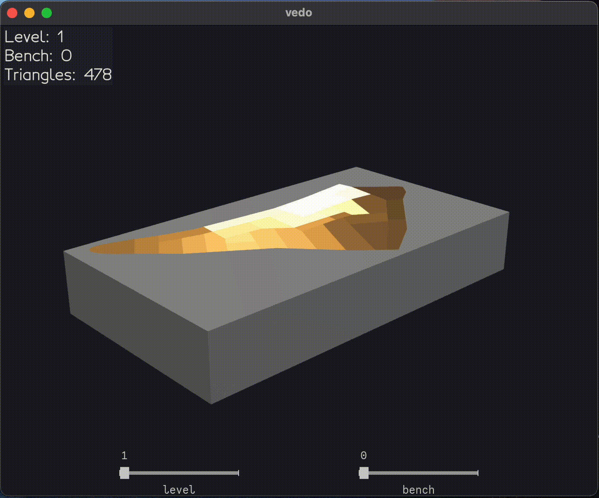

# Excavator — Bench Excavation Geometry Engine

A computational geometry pipeline for reconstructing a consistent excavation topology from noisy operational partitions.

This project constructs watertight triangulated excavation volumes from layered bench definitions and provides an interactive 3D viewer for inspection.

<p align="center">
  
</p>

## Features

- Robust partition domain construction from bench outlines
- Topology-safe triangulation pipeline
- Outer shell generation between excavation stages
- Half-edge mesh conversion
- Region-aware extrusion modeling
- Progressive excavation visualization
- Interactive 3D viewer (VTK / vedo)

## Quick Start

```bash
git clone https://github.com/eric-adam-garner/excavator.git
cd excavator
pip install -e .[viz]
excavator-demo
```

## Installation

Base installation (geometry engine only):

```bash
pip install -e .
```

Visualization installation:

```bash
pip install -e .[viz]
```

If visualization dependencies are missing, install with:

```bash
pip install excavator[viz]
```

## Pipeline Stages

1. Load benches
2. Construct partition domain
3. Validate topology
4. Triangulate bench domain
5. Build excavation shell domain
6. Triangulate shell
7. Convert to half-edge mesh
8. Assemble excavation sequence
9. Launch viewer

## Viewer Controls

Mouse:
- Left drag → rotate
- Right drag → pan
- Scroll → zoom

Keyboard:
- SPACE → toggle auto‑rotation

Sliders:
- bench → excavation progress within level
- level → excavation stage

## Architecture

CLI → Pipeline → Domain → Triangulation → Mesh → Extrusion → Visualization

## Logging Domains

- excavator.pipeline
- excavator.mesh
- excavator.domain
- excavator.triangulation
- excavator.app

## Requirements

Python = 3.12

Core:
- numpy
- scipy
- triangle
- trimesh

Visualization:
- vtk
- vedo

## License

MIT

## Author

Eric Garner
